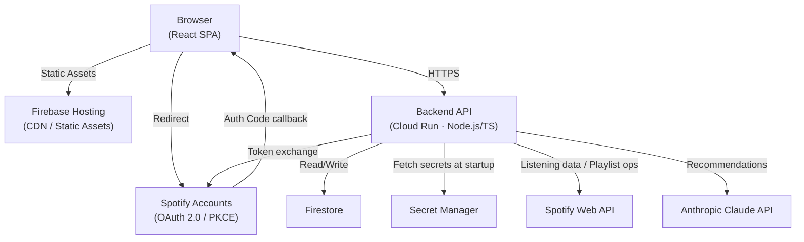
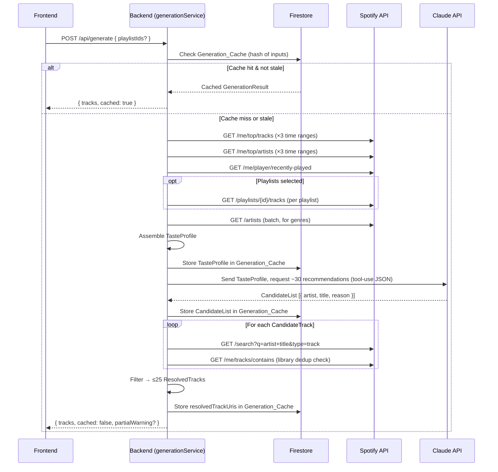
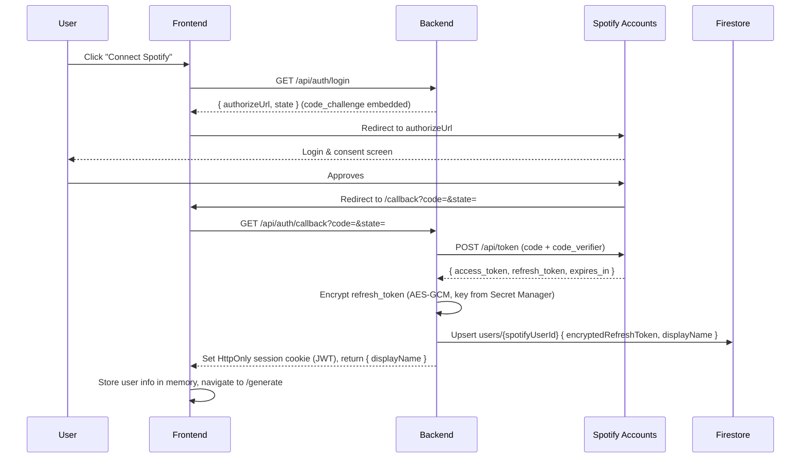
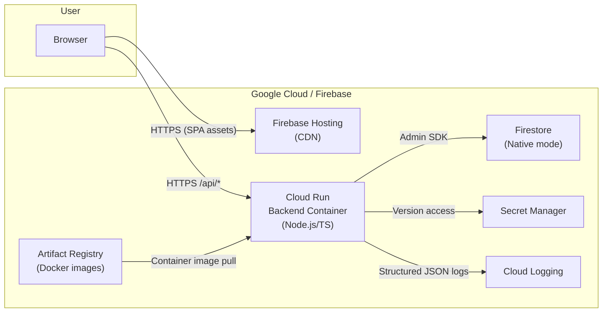

# Design Document: AI Music Playlist Generator

## Overview

The AI Music Playlist Generator is a web application that connects a user's Spotify account, analyzes their listening history, and uses Claude (Anthropic) to generate a curated list of ~25 new song recommendations. The user reviews the list, toggles individual tracks, and saves the result as a new private Spotify playlist.

**Technology stack:**
- **Frontend:** React SPA (TypeScript), served via Firebase Hosting / CDN
- **Backend:** Node.js / TypeScript on Google Cloud Run (containerized)
- **Database:** Google Cloud Firestore
- **Secrets:** Google Secret Manager
- **Auth:** Spotify OAuth 2.0 Authorization Code flow with PKCE
- **AI:** Anthropic Claude API (structured JSON output via tool-use)
- **Spotify API:** REST, scoped to endpoints available to new apps as of November 2024

**Key constraints:**
- The deprecated `/audio-features`, `/recommendations`, and `/related-artists` Spotify endpoints are not used.
- The Claude API key and Spotify client secret are fetched from Secret Manager at backend startup, never stored in environment variables or source code.
- All communication between frontend and backend is over HTTPS.

---

## Architecture



The backend is the only process that talks to Spotify API, Claude, Firestore, and Secret Manager. The frontend holds a short-lived session token (JWT-signed by the backend) in memory and sends it on every API call.

---

## Components and Interfaces

### Frontend Feature Structure

```
src/
  features/
    auth/
      AuthCallback.tsx       # Handles /callback route, exchanges code via backend
      AuthGuard.tsx          # Wraps protected routes
      useAuth.ts             # Auth state hook (session token, user info)
      authApi.ts             # login(), logout(), getMe() API calls
    generator/
      GeneratorPage.tsx      # Main page: playlist selector + generate CTA
      PlaylistSelector.tsx   # Grid of user playlists with checkboxes
      GenerateButton.tsx     # CTA with loading state
      generatorApi.ts        # POST /api/generate
    playlist/
      ResultsPage.tsx        # Shows resolved tracks, toggles, save CTA
      TrackCard.tsx          # Individual track card component
      TrackToggle.tsx        # Include/exclude toggle with visual state
      IncludedCount.tsx      # Live count badge
      SavePlaylistForm.tsx   # Optional custom name input + Save button
      playlistApi.ts         # POST /api/playlists/save
  components/
    ui/
      Card.tsx               # Base card shell (rounded, shadow, dark bg)
      PillBadge.tsx          # Genre / reason pill badge
      LoadingSpinner.tsx     # Full-screen and inline spinner
      ErrorBanner.tsx        # Human-readable error surface
      Button.tsx             # Primary / ghost button variants
  lib/
    apiClient.ts             # Axios instance with auth header injection
    correlationId.ts         # Reads X-Correlation-ID from responses
  App.tsx
  main.tsx
```

### Backend Layer Structure

```
src/
  routes/
    auth.ts              # GET /api/auth/login, GET /api/auth/callback, POST /api/auth/logout
    generate.ts          # POST /api/generate
    playlists.ts         # GET /api/playlists, POST /api/playlists/save
    health.ts            # GET /health
  services/
    authService.ts       # PKCE helpers, token exchange, token refresh, session JWT
    listeningDataService.ts  # Fetches top tracks, artists, recently played, playlist tracks
    tasteProfileService.ts   # Assembles and validates TasteProfile from raw data
    generationService.ts     # Orchestrates full pipeline, handles caching
    claudeService.ts         # Calls Anthropic API, parses CandidateList
    trackResolutionService.ts # Spotify Search + dedup + library filter
    playlistSaveService.ts   # Creates and populates Spotify playlist
  clients/
    spotifyClient.ts     # Typed Spotify API wrapper with retry/back-off logic
    claudeClient.ts      # Anthropic SDK wrapper
    firestoreClient.ts   # Firestore Admin SDK wrapper
  lib/
    secretManager.ts     # Loads secrets at startup, caches in memory
    logger.ts            # Structured JSON logger (Cloud Logging compatible)
    correlationId.ts     # Middleware: generates + attaches correlation IDs
    encryption.ts        # AES-GCM encrypt/decrypt for refresh tokens
    errors.ts            # AppError base class and typed error subclasses
  middleware/
    authenticate.ts      # Validates session JWT on protected routes
    errorHandler.ts      # Global error → structured 4xx/5xx response
  server.ts
```

---

## Key API Endpoints

All endpoints are prefixed `/api`. The backend returns `Content-Type: application/json` and includes `X-Correlation-ID` on every response.

### Authentication

| Method | Path | Auth | Description |
|--------|------|------|-------------|
| GET | `/api/auth/login` | None | Returns Spotify authorize URL with PKCE challenge; frontend redirects |
| GET | `/api/auth/callback?code=&state=` | None | Exchanges auth code → tokens; sets session JWT in HttpOnly cookie |
| POST | `/api/auth/logout` | Session | Clears session cookie |
| GET | `/api/auth/me` | Session | Returns `{ spotifyUserId, displayName }` |

### Generation

| Method | Path | Auth | Description |
|--------|------|------|-------------|
| POST | `/api/generate` | Session | Runs (or returns cached) generation pipeline; body: `{ playlistIds?: string[] }` |

**Response** `POST /api/generate`:
```json
{
  "generationId": "gen_abc123",
  "tracks": [ResolvedTrack],
  "partialWarning": false,
  "cached": true
}
```

### Playlists

| Method | Path | Auth | Description |
|--------|------|------|-------------|
| GET | `/api/playlists` | Session | Returns user's Spotify playlists (proxied from Spotify) |
| POST | `/api/playlists/save` | Session | Creates Spotify playlist from reviewed tracks |

**Request** `POST /api/playlists/save`:
```json
{
  "generationId": "gen_abc123",
  "includedTrackUris": ["spotify:track:xxx"],
  "playlistName": "My Custom Name"
}
```

**Response** `POST /api/playlists/save`:
```json
{
  "playlistId": "spotify_playlist_id",
  "playlistUrl": "https://open.spotify.com/playlist/..."
}
```

---

## Data Models

### Firestore Schema

```
users/
  {spotifyUserId}/                     # Document
    displayName: string
    encryptedRefreshToken: string      # AES-GCM, base64-encoded
    createdAt: Timestamp
    updatedAt: Timestamp

    generations/
      {generationId}/                  # Document
        createdAt: Timestamp
        inputPlaylistIds: string[]
        tasteProfile: TasteProfile     # Serialized JSON
        candidateList: CandidateTrack[]
        resolvedTrackUris: string[]
        savedPlaylistId?: string
        isStale: boolean               # true after 24 hours
        dialValue?: number             # V1: Discovery Dial
        vibePrompt?: string            # V1: Vibe Prompt
```

### TypeScript Interfaces

```typescript
// Taste profile assembled from listening data
interface TasteProfile {
  rankedGenres: Array<{ genre: string; count: number }>;
  topTracks: Array<{ title: string; artist: string; timeRange: SpotifyTimeRange }>;
  topArtists: Array<{ name: string; timeRange: SpotifyTimeRange }>;
  recentlyPlayed: Array<{ title: string; artist: string; playedAt: string }>;
}

type SpotifyTimeRange = 'short_term' | 'medium_term' | 'long_term';

// Raw recommendation from Claude
interface CandidateTrack {
  artist: string;
  title: string;
  reason: string;
}

// Claude's full response
interface CandidateList {
  tracks: CandidateTrack[];
}

// A Spotify track matched and confirmed playable
interface ResolvedTrack {
  spotifyUri: string;
  trackId: string;
  title: string;
  artist: string;
  albumName: string;
  albumArtUrl: string;           // 300x300 image URL
  spotifyUrl: string;
  reason: string;                // Forwarded from CandidateTrack
  durationMs: number;
}

// Generation result returned to frontend
interface GenerationResult {
  generationId: string;
  tracks: ResolvedTrack[];
  partialWarning: boolean;       // true if < 5 tracks resolved
  cached: boolean;
}

// User's Spotify playlist (for selection UI)
interface SpotifyPlaylist {
  id: string;
  name: string;
  coverImageUrl: string | null;
  trackCount: number;
}

// Session payload signed into JWT
interface SessionPayload {
  spotifyUserId: string;
  displayName: string;
  iat: number;
  exp: number;
}

// Frontend track state for review UI
interface TrackUIState {
  track: ResolvedTrack;
  included: boolean;
}
```

---

## Generation Pipeline

The core pipeline runs inside `generationService.ts` and is orchestrated as a sequential async pipeline with structured logging at each step.



### Cache Key

The generation cache key is a SHA-256 hash of `{ spotifyUserId, sortedPlaylistIds }`. This ensures the same input set always hits the same cache entry. Cache entries are marked stale 24 hours after `createdAt`.

### Retry Strategy

The `spotifyClient` wraps all requests with an exponential back-off retry decorator:
- **429 responses:** pause for `Retry-After` header value (seconds), then retry
- **5xx responses:** retry up to 3 times with delays of 1 s, 2 s, 4 s

### Claude Prompt Strategy

Claude is called using the Anthropic TypeScript SDK with a tool-use call that forces structured JSON output. The tool is named `recommend_tracks` and accepts the schema matching `CandidateList`. This eliminates JSON parsing failures and avoids relying on prompt-only JSON coercion.

---

## UI/UX Design

### Design Philosophy

The visual language is inspired by modern booking-card UIs: large imagery as the primary anchor, rich dark backgrounds, rounded cards with soft shadows, and a clear typographic hierarchy. Album artwork plays the role that property photos play in booking UIs — it is the first thing the eye lands on.

### Color Palette

| Token | Value | Usage |
|-------|-------|-------|
| `--bg-base` | `#0D0D0F` | Page background |
| `--bg-card` | `#18181C` | Card background |
| `--bg-card-hover` | `#1F1F26` | Card hover state |
| `--accent-primary` | `#1DB954` | Spotify green / primary CTA |
| `--accent-primary-hover` | `#1ED760` | CTA hover |
| `--text-primary` | `#FFFFFF` | Headings, track titles |
| `--text-secondary` | `#A1A1AA` | Artist name, metadata |
| `--text-muted` | `#52525B` | Disabled / placeholder |
| `--border-subtle` | `#27272A` | Card borders, dividers |
| `--shadow-card` | `0 4px 24px rgba(0,0,0,0.4)` | Card depth |
| `--excluded-overlay` | `rgba(0,0,0,0.55)` | Overlay on excluded tracks |

### Typography

- **Font:** Inter (system stack fallback: `-apple-system, BlinkMacSystemFont, sans-serif`)
- **Track title:** 16px / 600 weight
- **Artist name:** 14px / 400 weight / `--text-secondary`
- **Reason text:** 13px / 400 weight / `--text-muted` (italicized)
- **Count badge:** 12px / 700 weight / monospace

### Component Visual Specs

**TrackCard** — the core visual unit:
- Width: 100% of column (responsive grid)
- Border-radius: 16px
- Padding: 16px
- Background: `--bg-card`
- Box-shadow: `--shadow-card`
- Layout: album art (72×72px, border-radius 10px) on the left; title + artist + reason stacked right; toggle top-right
- Gradient overlay on album art (bottom 40%, `linear-gradient(transparent, rgba(0,0,0,0.6))`)
- Hover: scale(1.01) + shadow intensity increase (150ms ease)

**Excluded state:**
- Album art opacity: 0.35
- Card background: `--bg-card` with `--excluded-overlay`
- Title/artist text: `--text-muted`
- Toggle renders a distinct "excluded" color (`#EF4444`)

**PlaylistSelector:**
- Grid of playlist cards (cover image full-bleed top, name bottom)
- Selected state: Spotify green border (2px) + subtle inner glow
- Unselected: `--border-subtle`

**Generate Button:**
- Background: `--accent-primary`, height: 52px, border-radius: 12px
- Full-width on mobile, centered max-width 360px on desktop
- Disabled: opacity 0.5, cursor not-allowed
- Loading: spinner replaces label text

**IncludedCount Badge:**
- Pill shape, `--accent-primary` background, positioned top-right of results header
- Animated counter (CSS counter or spring animation on value change)

### Layout

```
Mobile (< 640px):          Desktop (≥ 1024px):
┌────────────────┐         ┌──────────┬────────────────────┐
│  Header / Logo │         │  Sidebar │   Main Content     │
│  User avatar   │         │  (Playlists + │  (Track cards grid) │
│                │         │  Generate btn)│                    │
│  Playlist grid │         └──────────┴────────────────────┘
│  Generate btn  │
│  Track cards   │
│  Save btn      │
└────────────────┘
```

### Micro-animations

- Track toggle: spring scale on the checkbox/pill (100ms)
- Card enter: staggered fade-in + translateY(8px → 0) on results load
- Loading spinner: CSS keyframe rotation
- Count badge: numeric value transition via CSS counter animation
- Excluded overlay: CSS transition on opacity (200ms ease-out)

---

## Authentication Flow



**PKCE implementation details:**
- `code_verifier`: 96-character random string (URL-safe base64, generated on backend per login request)
- `code_challenge`: SHA-256 hash of verifier, base64url-encoded (`S256` method)
- `state` parameter: random 16-byte hex string, verified on callback to prevent CSRF
- The verifier is stored server-side in a short-lived Firestore document (`pkceStates/{state}`) for the callback exchange — no client-side storage needed

**Session token:**
- HS256 JWT signed with a key from Secret Manager
- Payload: `{ spotifyUserId, displayName, iat, exp }`
- Expiry: 1 hour; the backend transparently refreshes the Spotify access token on each API call using the stored encrypted refresh token

---

## Error Handling Strategy

### Error Classification

| Category | HTTP Status | Frontend Behavior |
|----------|-------------|-------------------|
| Auth required / session expired | 401 | Redirect to login |
| Invalid input | 400 | Show inline field error |
| Spotify API error (non-retryable) | 502 | Show error banner, keep selection |
| Claude API error | 502 | Show error banner, re-enable Generate |
| Partial results (< 5 tracks) | 200 + `partialWarning: true` | Show warning pill, still show tracks |
| Server error | 500 | Generic error banner + correlation ID |
| Rate limit hit (after retries) | 429 | "Spotify is busy" message, retry suggestion |

### Backend Error Architecture

All errors extend `AppError`:

```typescript
class AppError extends Error {
  constructor(
    public readonly code: string,       // e.g. 'SPOTIFY_RATE_LIMIT'
    public readonly statusCode: number,
    public readonly message: string,
    public readonly isOperational: boolean = true
  ) { super(message); }
}
```

Specialized subclasses: `SpotifyApiError`, `ClaudeApiError`, `AuthError`, `CacheError`.

The global `errorHandler` middleware:
1. Logs the error at `ERROR` severity with stack trace and correlation ID
2. Maps `AppError` subclasses to their HTTP status codes
3. Returns `{ error: { code, message, correlationId } }` — no stack traces in responses
4. Treats non-`AppError` instances as unhandled (status 500, generic message)

### Frontend Error Architecture

`ErrorBanner` component renders above the results area. On any error response, `apiClient.ts` extracts `correlationId` from the response header and:
1. Logs `console.error('[CorrelationID]', correlationId)` for support purposes
2. Dispatches to the nearest error state (React context / Zustand slice)

Errors do **not** clear the user's current track selection state.

### Logging

All backend log entries conform to:
```json
{
  "severity": "INFO|WARNING|ERROR",
  "timestamp": "ISO8601",
  "correlationId": "uuid-v4",
  "spotifyUserId": "...",
  "step": "TASTE_PROFILE_ASSEMBLE|CLAUDE_REQUEST|TRACK_RESOLUTION|...",
  "message": "...",
  "durationMs": 123
}
```

Access tokens, refresh tokens, and API keys are never included in log output. User-identifiable fields are limited to `spotifyUserId`.

---

## Deployment Architecture



### Cloud Run Configuration

- **Concurrency:** 80 requests per container instance
- **Min instances:** 1 (avoid cold start on first request)
- **Max instances:** 10
- **CPU:** 1 vCPU
- **Memory:** 512 MB
- **Port:** 8080
- **Service account:** Least-privilege SA with roles: `roles/datastore.user`, `roles/secretmanager.secretAccessor`, `roles/logging.logWriter`
- **Environment variables (non-secret):** `NODE_ENV=production`, `PORT=8080`, `SPOTIFY_CLIENT_ID`, `FRONTEND_URL`
- **Secrets (from Secret Manager):** `SPOTIFY_CLIENT_SECRET`, `CLAUDE_API_KEY`, `JWT_SIGNING_KEY`, `REFRESH_TOKEN_ENCRYPTION_KEY`

### Firebase Hosting Configuration

- SPA rewrites: all routes → `index.html`
- Cache headers: long-lived for hashed assets, no-store for `index.html`
- Custom domain support via Firebase Hosting

### CI/CD (Design Decision)

Recommended pipeline (GitHub Actions):
1. `npm run typecheck && npm run test` (both frontend and backend)
2. `docker build` → push to Artifact Registry
3. `gcloud run deploy` with `--image` flag
4. Firebase Hosting deploy for frontend

---

## Correctness Properties

*A property is a characteristic or behavior that should hold true across all valid executions of a system — essentially, a formal statement about what the system should do. Properties serve as the bridge between human-readable specifications and machine-verifiable correctness guarantees.*

### Property 1: Refresh token encryption round-trip

*For any* valid Spotify refresh token string, encrypting it and then decrypting the result using the same key SHALL produce the original token string unchanged.

**Validates: Requirements 1.4**

---

### Property 2: User document upsert contains required fields

*For any* valid Spotify user identity (user ID and display name), calling the authentication upsert function SHALL result in a Firestore document containing both `displayName` and `createdAt` fields with non-empty values.

**Validates: Requirements 1.7**

---

### Property 3: Retry back-off count is bounded

*For any* sequence of 1–3 consecutive 5xx responses from the Spotify API, the `spotifyClient` SHALL retry the request at most 3 times before propagating an error, and SHALL never make more than 4 total attempts (original + 3 retries) for a single logical request.

**Validates: Requirements 2.7**

---

### Property 4: Genre ranking is sorted by descending frequency

*For any* collection of artist objects with genre arrays, the genre ranking produced by `tasteProfileService.rankGenres` SHALL be ordered such that for every adjacent pair `(genres[i], genres[i+1])`, `genres[i].count >= genres[i+1].count`.

**Validates: Requirements 3.1**

---

### Property 5: Taste profile contains all required fields

*For any* valid listening data input (top tracks, top artists, recently played), the assembled `TasteProfile` SHALL contain non-empty values for all four required fields: `rankedGenres`, `topTracks`, `topArtists`, and `recentlyPlayed`.

**Validates: Requirements 3.2, 3.3**

---

### Property 6: Taste profile respects size limits

*For any* listening data of any size, the assembled `TasteProfile` SHALL contain at most 50 top tracks, 20 top artists, and 50 recently played tracks — even if the input data is larger than these limits.

**Validates: Requirements 3.4**

---

### Property 7: Candidate list entries have required fields

*For any* response from the Claude `recommend_tracks` tool call, every entry in the parsed `CandidateList` SHALL have non-empty `artist`, `title`, and `reason` string fields.

**Validates: Requirements 4.2**

---

### Property 8: Resolved list contains no library duplicates or unresolved entries

*For any* candidate list and any user library snapshot, every track in the `ResolvedTrack` list SHALL (a) have a valid Spotify URI that matched a real Spotify track, and (b) NOT appear in the user's existing Spotify library.

**Validates: Requirements 5.3, 5.4**

---

### Property 9: Resolved list length is bounded at 25

*For any* resolution run, the list of `ResolvedTrack` objects returned SHALL contain at most 25 entries, regardless of how many candidates were received from Claude.

**Validates: Requirements 5.5**

---

### Property 10: Partial-results warning fires below threshold

*For any* resolution run that produces fewer than 5 `ResolvedTrack` objects, the `GenerationResult` SHALL include `partialWarning: true`. *For any* resolution run that produces 5 or more tracks, `partialWarning` SHALL be `false`.

**Validates: Requirements 5.6**

---

### Property 11: Track card render includes all required display fields

*For any* `ResolvedTrack` object, rendering it with `TrackCard` SHALL produce output that includes the album art URL, track title, artist name, the Claude-generated reason text, and a valid Spotify URL.

**Validates: Requirements 6.1**

---

### Property 12: Track selection count matches included tracks

*For any* `TrackUIState[]` array, the value returned by the included-count selector SHALL equal the number of elements where `included === true`. This holds across all possible combinations of toggle states.

**Validates: Requirements 6.2, 6.4**

---

### Property 13: Default playlist name follows ISO 8601 format

*For any* valid `Date` object passed as the generation timestamp, the default playlist name produced by the naming function SHALL match the pattern `"AI Music Generator — YYYY-MM-DD"` where `YYYY-MM-DD` is the ISO 8601 date extracted from that timestamp.

**Validates: Requirements 7.6**

---

### Property 14: Playlist card render includes name and image

*For any* `SpotifyPlaylist` object, rendering it with the playlist selector card SHALL produce output that includes the playlist name and, when `coverImageUrl` is non-null, the image URL.

**Validates: Requirements 8.4**

---

### Property 15: Correlation ID propagates through all log entries

*For any* API request that produces a `correlationId`, every structured log entry emitted during that request's lifecycle SHALL contain that same `correlationId` value, and the response header `X-Correlation-ID` SHALL also carry it.

**Validates: Requirements 10.3**

---

### Property 16: Cache returns identical result for identical inputs

*For any* `(spotifyUserId, sortedPlaylistIds)` pair, if a non-stale `GenerationResult` is stored in the cache for that input pair, then calling `generationService.generate` with those same inputs SHALL return the cached result unchanged — without making new calls to Spotify API or Claude.

**Validates: Requirements 11.1, 11.2**

---

## Testing Strategy

### Dual Testing Approach

This feature uses both unit/example-based tests and property-based tests. They are complementary: unit tests verify concrete scenarios and integration points; property tests verify universal invariants across the full input space.

### Property-Based Testing

The project uses **[fast-check](https://fast-check.dev/)** for property-based testing (TypeScript/JavaScript, well-maintained, 100+ iterations by default).

Each property test:
- Runs a minimum of **100 iterations** with randomized inputs
- Is tagged with a comment referencing its design property:
  ```typescript
  // Feature: playlist-generator, Property 4: Genre ranking is sorted by descending frequency
  ```

**Properties and their target modules:**

| Property | Module Under Test | Test File |
|----------|-------------------|-----------|
| P1: Token encryption round-trip | `lib/encryption.ts` | `encryption.test.ts` |
| P2: User document upsert fields | `services/authService.ts` | `authService.test.ts` |
| P3: Retry count bounded | `clients/spotifyClient.ts` | `spotifyClient.test.ts` |
| P4: Genre ranking sorted | `services/tasteProfileService.ts` | `tasteProfileService.test.ts` |
| P5: Taste profile required fields | `services/tasteProfileService.ts` | `tasteProfileService.test.ts` |
| P6: Taste profile size limits | `services/tasteProfileService.ts` | `tasteProfileService.test.ts` |
| P7: Candidate list fields | `services/claudeService.ts` | `claudeService.test.ts` |
| P8: Resolved list purity | `services/trackResolutionService.ts` | `trackResolutionService.test.ts` |
| P9: Resolved list max 25 | `services/trackResolutionService.ts` | `trackResolutionService.test.ts` |
| P10: Partial warning threshold | `services/trackResolutionService.ts` | `trackResolutionService.test.ts` |
| P11: Track card render fields | `features/playlist/TrackCard.tsx` | `TrackCard.test.tsx` |
| P12: Selection count invariant | `features/playlist/` (selector fn) | `trackSelection.test.ts` |
| P13: Default playlist name format | `services/playlistSaveService.ts` | `playlistSaveService.test.ts` |
| P14: Playlist card render fields | `features/generator/PlaylistSelector.tsx` | `PlaylistSelector.test.tsx` |
| P15: Correlation ID propagation | `lib/correlationId.ts` + middleware | `correlationId.test.ts` |
| P16: Cache idempotence | `services/generationService.ts` | `generationService.test.ts` |

### Unit / Example-Based Tests

Unit tests use **Vitest** (frontend and backend) with **@testing-library/react** for component tests.

Focus areas:
- Auth flow steps: login redirect, callback exchange, refresh token rotation, session expiry
- Error branches: Claude malformed JSON retry, Spotify 429/5xx after retry exhaustion, playlist save failure
- UI state transitions: loading indicator while generating, error banner display, save confirmation
- Cache staleness: 24-hour TTL boundary

### Integration Tests

Light integration tests (with mocked external services via `msw` / `nock`) cover:
- Full generation pipeline with a fixture taste profile → fixture Claude response → fixture Spotify search results
- Playlist save end-to-end (create + populate)
- Token refresh path when access token is expired

### Test Configuration

```json
// vitest.config.ts (shared base)
{
  "test": {
    "environment": "node",
    "coverage": { "provider": "v8", "threshold": { "lines": 80 } }
  }
}
```

Run all tests (non-watch):
```bash
npx vitest run
```
